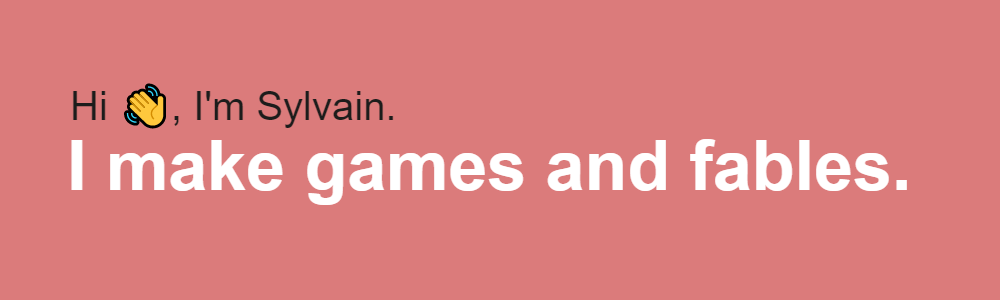

### Sylvain Tran's Github  

  
  

### 
I'm Sylvain, a Canadian Frontend & Interactive Media programmer, and 3D Design Generalist. 🚀
    

- 🔭 I’m currently working on [Speculative Play 2](https://github.com/SylvainTran/speculative-futures-project-2), [You Never Lied](https://github.com/SylvainTran/You-Never-Lied) and [A CBT Game](https://github.com/SylvainTran/deepwell_gamejam_2022)  
  

- 🌱 I’m currently learning Front End web development with JavaScript, Unity and C# more in depth. 
  

- ❓ Chat me about anything related to game design, level design, Jesus Christ our Savior, Unity and other game development technologies.  
  

- ⚡ Fun fact: I am itching to go outside!  
  

   

## My Skill Set  
<table><tr><td valign="top" width="33%">

### Frontend  

  
  
  
  
  
  
  
  
  

</td><td valign="top" width="33%">

### Backend  

  
  
  
  
  
  
  
  
  
  
  
  
  
  
  
  
  
  
  

</td><td valign="top" width="33%">

### DevOps  

  
  
  

</td></tr></table>  

   

## Connect with me  

  

  
  

   

## Github Stats  

### Stats Don't Define You  

  

   

## Recent Blog Posts  
  

   

  

   

  
  

   

 

----

Generated using <a href="https://profilinator.rishav.dev/" target="_blank">Github Profilinator</a>

